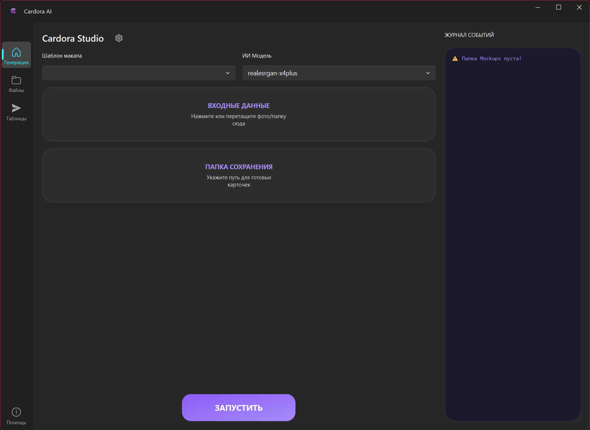
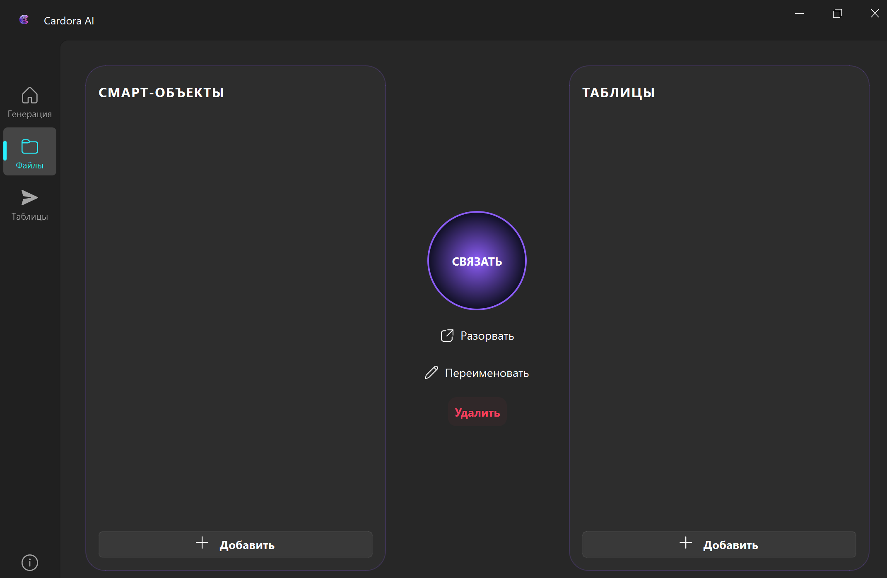
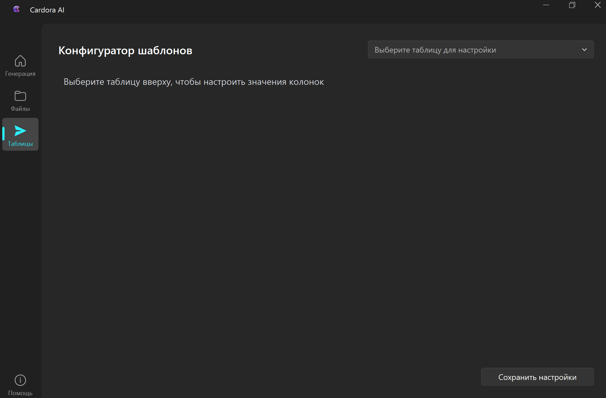

<!-- HEADER: PURPLE NEON STYLE -->

 

<!-- TYPING TEXT -->

    Промышленный стандарт автоматизации для селлеров Wildberries и Ozon

<!-- BADGES -->

    
    
    
    
    

 

## 🛸 О Проекте | The Mission

**Cardora AI** — это не просто редактор, это автономная рабочая станция, заменяющая целый отдел контента.
Мы объединили **нейросети (Computer Vision)**, **промышленную автоматизацию Photoshop** и **работу с данными (Excel)** в единый конвейер.

> **Ваша выгода:** Вы загружаете папку с "сырыми" фото — через 5 минут получаете готовые карточки и заполненную спецификацию для загрузки на маркетплейс.

---

## 📺 Демонстрация работы

Посмотрите, как Cardora обрабатывает реальный кейс за 60 секунд.

  <!-- ПРЕВЬЮ ВИДЕО -->
  <!-- Загрузи скриншот видео в папку assets и назови video_preview.jpg -->
  
  
   
  
  <!-- КНОПКИ ВЫБОРА ПЛАТФОРМЫ -->
  
  &nbsp;&nbsp;
  

---

## ⚡ Функциональные модули

### 1. 🧠 Центр Генерации (AI Core)
Сердце системы. Здесь происходит магия улучшения качества.
*   **Умный Апскейл:** Если фото плохого качества, нейросеть (Real-ESRGAN) достраивает пиксели, превращая размытое изображение в четкое 4K.
*   **Smart Skip:** Если фото уже качественное (>1500px), система пропускает тяжелую обработку, экономя время.
*   **Защита железа:** Алгоритм тайлинга и пауз защищает ваш ПК от перегрева даже при обработке 1000 товаров.

  

 

### 2. 📂 Менеджер Ресурсов (Smart Linking)
Забудьте о путанице в файлах.
*   **Связи:** Вы один раз указываете, какой PSD-макет подходит к какой таблице Excel.

  

 

### 3. 📊 Конфигуратор Данных (Excel Hub)
Автоматическое заполнение спецификаций для Wildberries/Ozon.
*   **Без ошибок:** Программа сама вписывает артикулы сгенерированных фото в таблицу.
*   **Шаблонизация:** Настройте бренд, цену и описание один раз — они автоматически продублируются для всех товаров в партии.

  

---

<!-- СЕКЦИЯ ДЛЯ РАЗРАБОТЧИКОВ (СПОЙЛЕР) -->

<h2>🛠️ Engineering Deep Dive (Архитектура и Стек)</h2>

 
Этот раздел предназначен для технических специалистов и HR, желающих понять внутреннее устройство системы.

### 🏗️ Core & Architecture
*   **Language:** Python 3.12 (LTS Stability).
*   **UI Framework:** PySide6 (Qt6) + Fluent Design System (Acrylic/Mica effects).
*   **Build System:** Проект скомпилирован в машинный код через **Nuitka** (Standalone Mode), что обеспечивает производительность C++ и защиту исходников.

### 🧠 Computer Vision & AI
*   **Engine:** Real-ESRGAN (Vulkan/ncnn implementation) для GPU-ускорения.
*   **Processing:** Pillow (PIL) для пре-процессинга, геометрических трансформаций и анализа метаданных.
*   **Optimization:** Реализован алгоритм **Tiling** (сегментация) для обработки 4K изображений на видеокартах с малым объемом VRAM.

### 🎨 Automation & Data Logic
*   **Photoshop Bridge:** Собственная реализация COM-интерфейса (Dynamic JSX Injection).
*   **Data Engine:** OpenPyXL для сложного парсинга и генерации Excel-отчетов.
*   **Persistence:** Локальная JSON-база данных для хранения связей и настроек сессий.

### 🛡️ Security & Enterprise Features
*   **Hardware Fingerprinting:** Генерация уникального HWID на основе серийных номеров CPU и Disk Drive (WMI Requests).
*   **Cloud Control:** Система удаленной проверки лицензий.
*   **Anti-Tamper:** Бинарная защита исполняемого файла от реверс-инжиниринга.

  

<!-- КОНЕЦ СЕКЦИИ ДЛЯ РАЗРАБОТЧИКОВ -->

---

## 📥 Как начать работу?

1.  Перейдите во вкладку [**Releases (Скачать)**](../../releases).
2.  Загрузите файл `CardoraStudio_v1.0_Setup.exe`.
3.  Установите программу (Инсталлятор сам настроит все драйверы Visual C++).
4.  При запуске скопируйте ваш **Hardware ID**.

---

## 📞 Контакты и Приобретение

Готовы ускорить работу в 10 раз? Свяжитесь с нами для получения демо-ключа или покупки полной версии.

  

  

    

    DEVELOPED BY YGALAXYY • 2026 
    POWERED BY NEURAL NETWORKS
    

