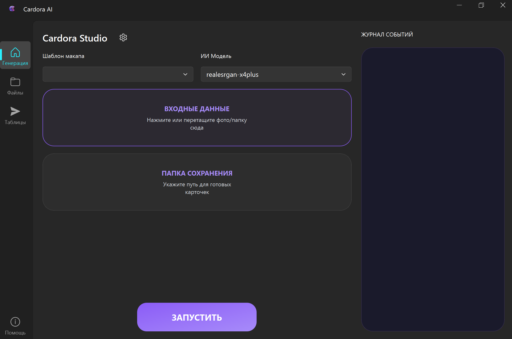
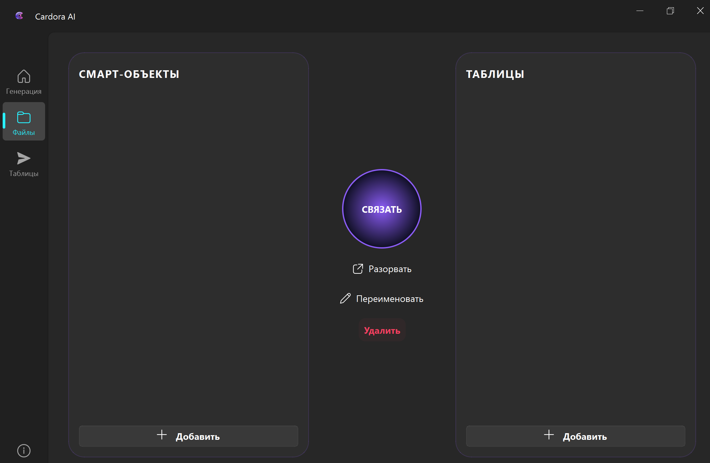
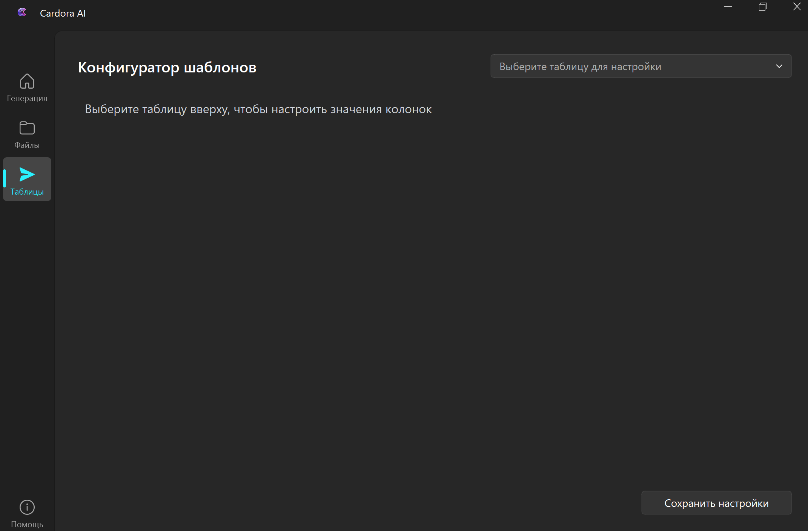

<!-- LOGO -->

<h1 style="color: #A970FF; font-size: 55px; margin-bottom: 0; font-family: 'Segoe UI'; font-weight: 800;">🌌 CARDORA AI</h1>

Next-Gen Enterprise Content Automation Ecosystem

<!-- BADGES -->

    
    
    
    

 

## 🛸 О Проекте | About The Project

**Cardora AI** — это промышленный программный комплекс, предназначенный для полной автоматизации производственного цикла карточек товаров. Система исключает человеческий фактор из процессов ретуши, масштабирования, наложения на макеты и подготовки отчетности для маркетплейсов.

> [!IMPORTANT]
> Продукт ориентирован на Enterprise-сегмент. Включает в себя облачную систему контроля лицензий и защиту ядра от реверс-инжиниринга.

---

## ⚡ Key Capabilities (Ключевые возможности)

### 🧠 Модуль ИИ-Визуализации
*   **Neural Super-Resolution:** Интеграция ядер `Real-ESRGAN (Vulkan/ncnn)`. Увеличение разрешения в 4 раза с интеллектуальным восстановлением текстур.
*   **Safe-GPU Processing:** Технология умного тайлинга (`tile size 64`). Стабильная работа на любых видеокартах без "черных квадратов".
*   **Pre-processing:** Автоматическое зеркалирование и поворот изображений на этапе подготовки.

### 🎨 Photoshop Automation Engine
*   **Dynamic Injection:** Генерация на лету JSX-скриптов для управления Adobe Photoshop.
*   **Two-Phase Pipeline:** Разделение этапов апскейла и вставки. Photoshop запускается только после подготовки всех ассетов, что ускоряет процесс на 30%.
*   **Smart Export:** Генерация набора слайдов и PDF-файлов для печати в одно касание.

### 📊 Конфигуратор Данных (XLSX Hub)
*   **Smart Linking:** Уникальная система связки PSD-макапа с конкретной таблицей-шаблоном.
*   **Auto-Population:** Программа сама вписывает артикулы в нужные колонки, дублируя статичные параметры (цена, бренд, описание), настроенные в интерфейсе.
*   **Template Cleaning:** Автоматическая очистка шаблонов от данных предыдущих сессий.

---

## 🛡️ Безопасность и Дистрибуция

*   **HWID Protection:** Привязка каждой копии софта к уникальному идентификатору оборудования (CPU + Disk ID).
*   **Cloud Control:** Удаленное управление лицензиями через Google Cloud Sheets (возможность мгновенной блокировки доступа).
*   **Anti-Tamper:** Код скомпилирован в машинный код (C++) через Nuitka, что делает декомпиляцию практически невозможной.

---

## 🛠 Технологический Стек

*   **Language:** Python 3.12 (High Stability)
*   **UI Framework:** PySide6 (Qt6) + Fluent Design System
*   **Image Processing:** Pillow (PIL), Real-ESRGAN
*   **Automation:** Adobe Photoshop API (JavaScript Injection)
*   **Database:** JSON-based persistent storage
*   **Data Science:** OpenPyXL (Excel Engine)

---

## 📸 Галерея Интерфейса

  
<b>Рабочий стол (Генерация)</b>

  
  
  
<b>Менеджер ресурсов (Связи файлов)</b>

  
  
  
<b>Конфигуратор таблиц</b>

  

---

## 📥 Инструкция по установке

1.  Скачайте инсталлятор из раздела [Releases](../../releases).
2.  Запустите `CardoraStudio_Setup.exe` от имени администратора.
3.  После установки откройте приложение и нажмите иконку **"Копировать ID"** в окне активации.
4.  Передайте данный ID администратору для получения лицензионного ключа.

---

    

    DEVELOPED BY YGALAXYY • 2026 
    FOR ENTERPRISE COMMERCIAL USE ONLY
    

